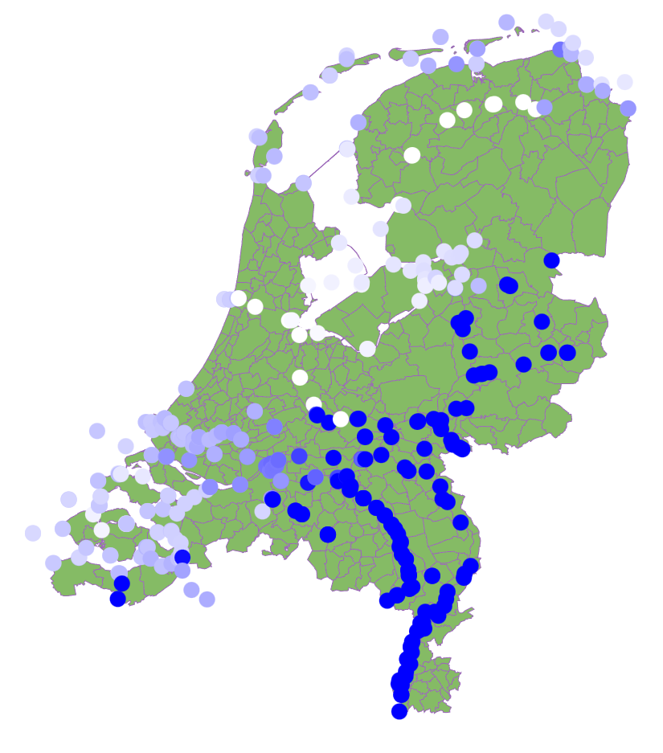

# Plotting a Choropleth chart with NAP data

## Creating a map of the Netherlands

https://gist.github.com/TWIAV/94be9cb4ddf3a2e65602 [2009]

https://cartomap.github.io/nl [all years]

## Converting Rijksdriehoeks coordinates to WGS84 coordinates

https://github.com/djvanderlaan/rijksdriehoek

## Converting UTM to WGS84 coordinates

https://github.com/Kevo89/UTM2LatLong/blob/master/utm2wgs.py 

## Converting GeoJSON to TopoJSON

https://mapshaper.org/

## Example

