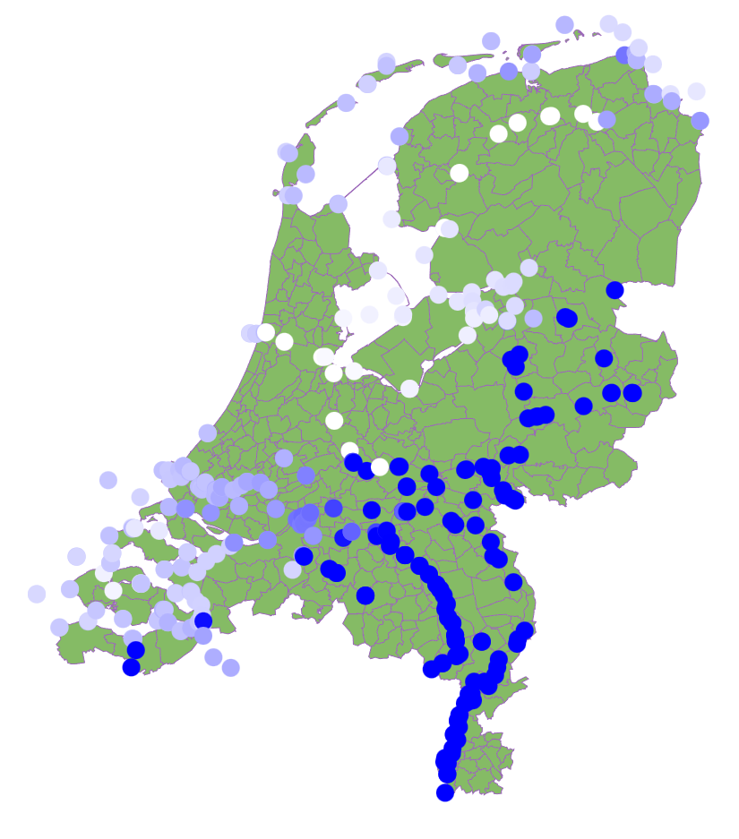

# InfoVis
Data Visualisation project

### Links

Height of Netherlands data
https://app.pdok.nl/rws/ahn3/download-page/#

Water heights of Netherlands data
https://waterinfo.rws.nl/#!/nav/bulkdownload/huidige-selectie/

### Questions

How much will the water level in the Netherlands rise in different situations, and what would the effect be regarding the population? 

Are temprature, rain, pollution etc causes (correlated) with a rising sea level?

### Visualisations

choropleth map (over time with slider)

Scatter plot with trendline for different scenarios

# Plotting a Choropleth chart with NAP data

## Creating a map of the Netherlands

https://gist.github.com/TWIAV/94be9cb4ddf3a2e65602 [2009]

https://cartomap.github.io/nl [all years]

## Converting Rijksdriehoeks coordinates to WGS84 coordinates

https://github.com/djvanderlaan/rijksdriehoek

## Converting UTM to WGS84 coordinates

https://github.com/Kevo89/UTM2LatLong/blob/master/utm2wgs.py 

## Converting GeoJSON to TopoJSON

https://mapshaper.org/

## Example

### Spin up a webserver
python -m http.server 1337 or use webstorm